# Mirage

**An AI-native 3D renderer + lightweight physics simulator** — built to be driven by coding agents (e.g. Claude Code via [MCP](https://modelcontextprotocol.io)), aimed at robotics and synthetic-data use cases.

> **Status:** 🌿 the native core has landed. One **legible op-log** is the source of truth; a **first-party C++20 core** builds it (byte-identical Python + C++ mesh kernels), a from-scratch **path tracer** (`mirage_render`) shoots the ground-truth stills, and a **native GL viewport** (`mirage_viewer`) is the realtime preview — no external DCC. Multi-object **scenes + physics** ride OpenUSD + MuJoCo behind small interfaces. Full design & roadmap: [docs/design.md](docs/design.md).

## Gallery

Every image below is one op-log replayed through the native mesh kernel and shot
with the in-repo path tracer — no external DCC, no fakes.

**Beyond primitives** — a passenger jet modeled entirely from the engine's own
operators: a surface-of-revolution fuselage (the lathe), lofted swept wings with
winglets, capped-cylinder engines on pylons, all mirrored for symmetry and given
a per-face livery, then path-traced. Reproduce with `uv run python examples/airplane.py`.


That op-log isn't a static export — it's a *sequence of operations you can replay*.
Here is that jet **being modelled in Mirage's own viewport**, assembling operator by
operator — fuselage (a lathe), wings and tailplane (lofted, then mirrored), the fin,
and the podded engines — then a gentle turn to show it off. **Every frame is a headless
screenshot of the real native GUI** (`mirage_viewer`) fed a growing op-log, so this is
the tool building the model, not a mock-up. The recorder is a reusable module —
`mirage.capture.record_build(stages, …)` films any op-log the same way, so every polished
case can be captured — regenerate this one (`.mp4` for video, `.gif` for inline) with
`uv run python docs/gallery/render_viewer_build.py`.

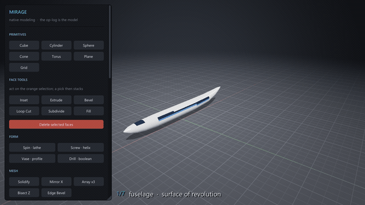

**A whole interior — every object native, and the *engine* composes it.** A furnished
room where each thing is modelled from Mirage's own operators (the lathe turns the vase
and lampshade, `bevel` rounds the sofa, `array` stacks the shelves, `boolean` cuts the
window), assembled by the first-class **`place` operator**: the scene is a *legible
op-log* of `place` ops, each carrying its object's operators and a transform, so the
op-log stays multi-object and human/AI-editable — not baked geometry, not Python glue.
That op-log builds byte-identically in the Python kernel and the C++ core, and the path
tracer shoots it from a camera *inside* the room. Reproduce with `uv run python
examples/cases/18_interior_scene.py --hero`.

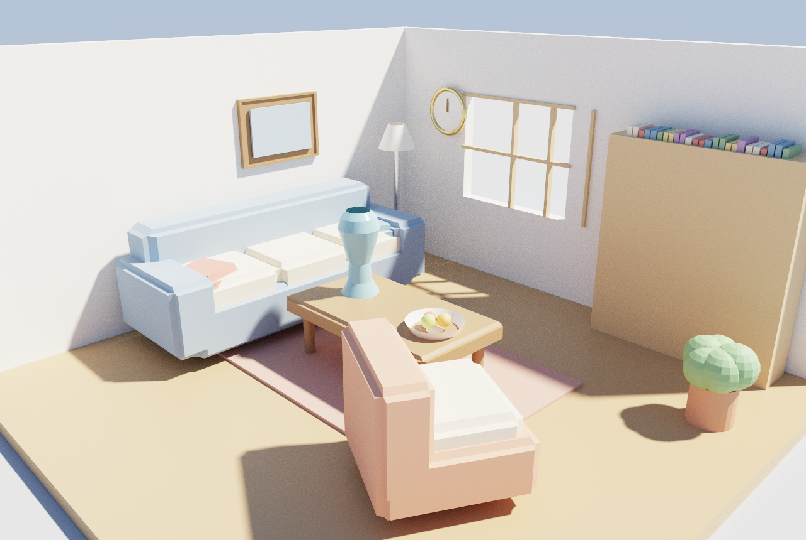

Here is that room **being built in Mirage's own viewport**, in the editor's **AUTO mode** —
when the AI is driving the op-log the tool panel steps aside for a top-left status HUD
(*what's being modelled right now*), so the frame is all model: the lathe sweeping the vase,
`boolean` punching the window, `bevel` rounding the armchair, then each object *placed* — and
it **settles onto a path-traced close-up** of the finished scene (the real-time viewport for
the build, the first-party path tracer for the money shot, both off one op-log). Regenerate
with `uv run python examples/cases/18_interior_scene.py --film` (add `ANIM_RAYTRACE=1` for a
fully path-traced promo pass).

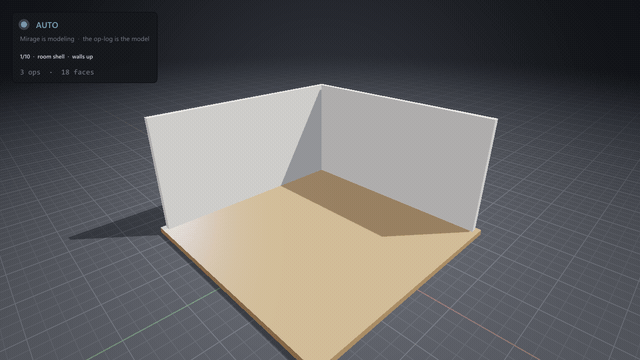

And the same build **rendered entirely by the first-party path tracer** — every frame global
illumination, soft shadows, sky+sun — a promo pass (`ANIM_RAYTRACE=1 … --film`), kept clean at
low sample counts by the tracer's own **edge-avoiding à-trous denoiser** (`--denoise`):

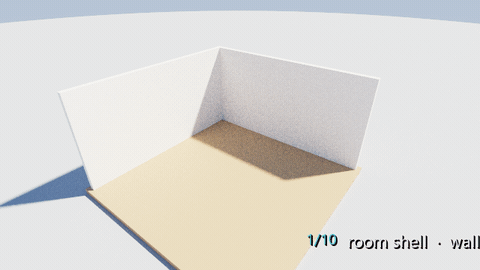

(How large scenes scale, and where the layers used to bottleneck, is measured in
[docs/scene-scaling.md](docs/scene-scaling.md) — the composition seam that once forced a
manual merge is now closed by the `place` op.)

## Parametric — the op-log is a re-runnable generator

The model isn't a bag of geometry to poke at; it's a **legible program**. Give the op-log a
`params` block, arithmetic **expressions** in any numeric field, and a `repeat` loop, and the
whole form regenerates when you change one number — `floors` stacks storeys, `twist` spirals
them, `taper` pinches the silhouette. Five legible ops resolve to ~100. This is the thing a
puppet-an-app MCP can't do — and it's **byte-identical in the C++ core and the Python kernel**
(differential-tested), so a parametric op-log path-traces and loads in the GUI natively.

Sweep two parameters over that one program and you get a **design space** — 16 towers, each
path-traced and denoised (`examples/cases/19_parametric_tower.py --grid`):

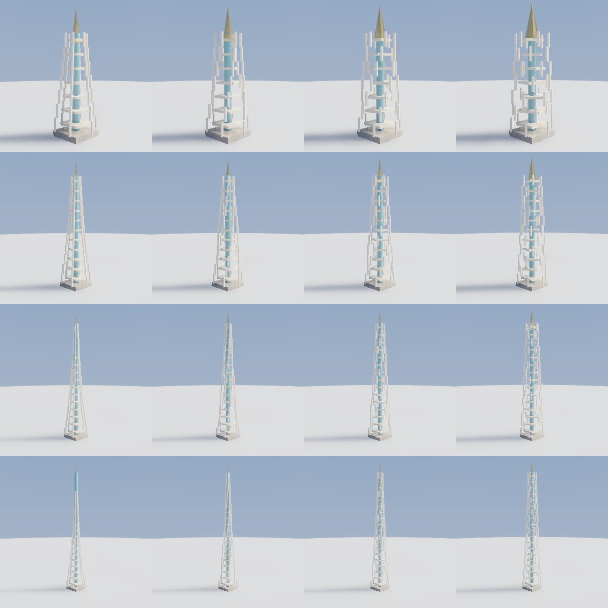

…or animate a parameter and the structure morphs, every frame path-traced (`--morph`):

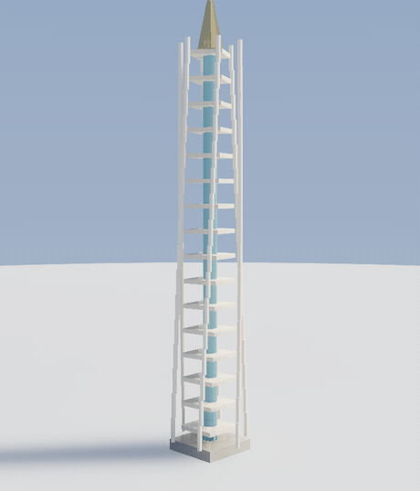

And it scales all the way up: the *same* machinery — `params`, expressions, nested `repeat` —
builds a whole **classical temple** (a stepped stylobate, a peristyle of columns on all four
sides, an entablature, a gabled roof with pediments) from 16 legible ops
(`examples/cases/22_parametric_temple.py`). Path-traced under a low, art-directed sun
(`--sun-dir`) so the colonnade rakes long shadows across the stone:

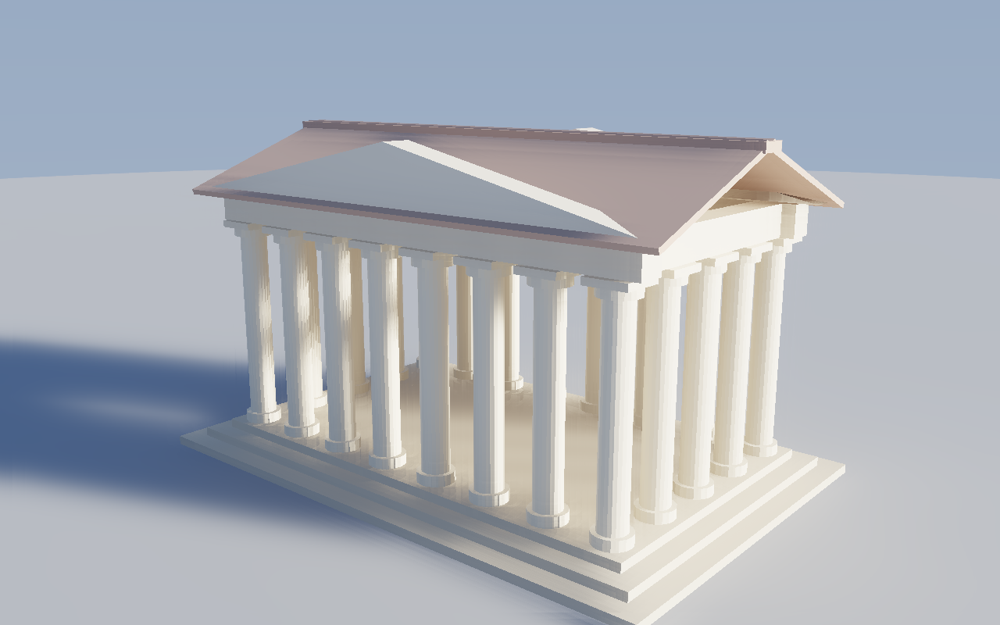

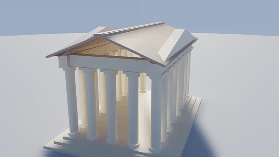

**How big can it get?** Two ceilings, far apart. Composing *separate objects* through the
legible `place` op is O(N²) — a wall around 1–2k objects. But a single `mesh` op sidesteps
that, and the tracer's BVH eats **millions of triangles**: this displaced-noise mountain range
is **1.28M triangles in one op**, path-traced at 220 spp (measured on a 152-core box, 7.2M tris
render in ~42 s / ~8 GB). Numbers in [docs/scene-scaling.md](docs/scene-scaling.md).

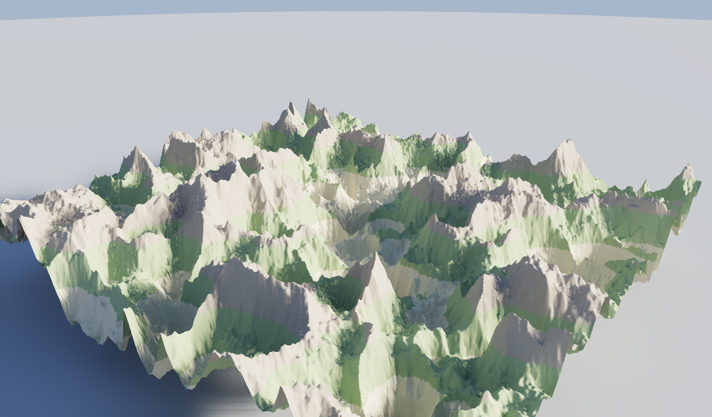

## Diff & merge — the model is version-controllable

Because the op-log is legible, two versions can be **diffed** and **3-way merged** like source
code — a human at the GUI and an AI over MCP editing the same model on separate branches, then
reconciling. Disjoint edits to different objects merge automatically; a spot both changed
differently surfaces as a **conflict** (never silently lost). No opaque scene file can do this.

Below: one base scene, a *human* branch (recolour the vase, move the bowl) and an *AI* branch
(repaint the floor, add a book) — `merge_by_key` combines all four edits with zero conflicts,
and the render proves every one landed (`examples/cases/20_diff_merge.py`):

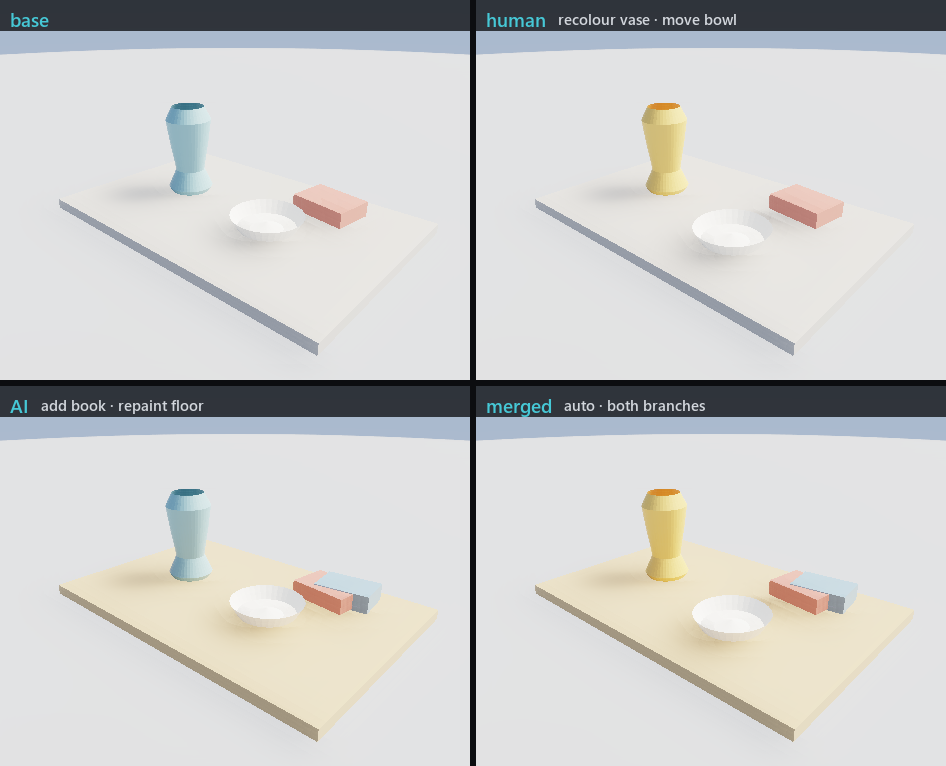

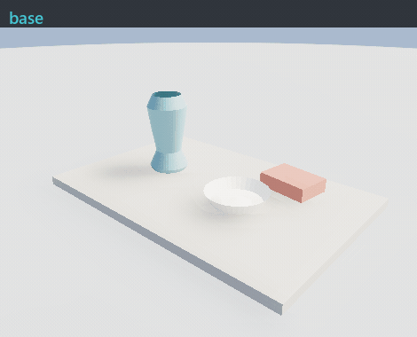

## Self-refinement — the agent sees its own model and fixes it

A puppet-an-app MCP is blind: it fires commands and can't tell what came out. Mirage's agent
can **read** the op-log, **render** it (first-party tracer + denoiser), **look** at the frame,
and **edit** the op-log to fix what it sees — a closed perception→action loop on its own
creation. Starting from a scene with deliberate, render-only flaws — a floating vase, a book
clipping it, a muddy bowl, a blown-out frame — it converges round by round, *each edit derived
from the previous render* (`examples/cases/21_self_refine.py`):

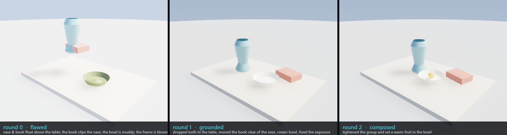

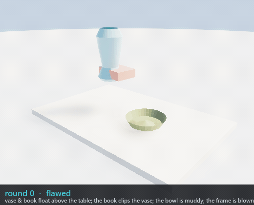

The core operators, one panel each (regenerate with `uv run python docs/gallery/render_gallery.py`):


| | operator | what it is |
|---|---|---|
| **1** | `screw` | the helical sweep — a section revolved *while climbing the axis* → springs, threads, augers |
| **2** | `curvature` selector | selection-as-query by mean dihedral: the flat-ish cap resolves apart from the round body |
| **3** | `profile` | a first-class 2D generatrix — an **open** wire revolved makes a single-walled, hollow vase |
| **4** | `boolean` | real BSP mesh-mesh CSG (union / difference / intersection) — here a cube minus a cylinder bore |

Each modeling operator is implemented **byte-identically in the C++ core and the
Python kernel** and pinned by differential tests, so one op-log builds the same
mesh in either engine.

## Why

Powerful DCC tools (Blender, …) have large, stateful automation surfaces that are awkward for programmatic/agent control. Full robotics simulators are excellent but heavy. Mirage takes the opposite bet:

- **Scene = plain data.** The whole world is one serializable object (JSON today, USD later). An agent can read it, diff it, edit it, and reproduce it deterministically.
- **Tiny, swappable backends.** A backend just consumes a `Scene`: `render(scene, camera)` or `step(scene, dt)` — MuJoCo behind both, permissively licensed. (Photoreal stills of a *model* take a different path: the op-log goes straight to Mirage's own `mirage_render` path tracer.)
- **AI-native control surface.** A first-class MCP server exposes the build/step/render loop as a handful of orthogonal tools, so Claude Code can drive Mirage out of the box.
- **Light, fast, permissive.** Python conducts; the heavy lifting is native — Mirage's own C++ mesh kernel and `mirage_render` path tracer, plus OpenUSD and MuJoCo behind small interfaces. Apache-2.0, no GPL entanglement.

## Quickstart

```bash
git clone https://github.com/saofund/mirage
cd mirage
pip install -e .
python examples/falling_box.py
```

## Use with Claude Code (and Codex, and any MCP client)

This repo ships a **project-scoped** MCP config (`.mcp.json`), so Claude Code
picks Mirage up automatically when you open this folder as the workspace:

```bash
pip install -e ".[usd,mujoco,mcp,demos]"   # full surface: USD scene + MuJoCo physics/render + MCP
cd mirage                 # the project root, where .mcp.json lives
claude                    # approve the 'mirage' MCP server when prompted
```

Then `/mcp` shows `mirage` connected. The agent can **author** (`add_box`,
`add_sphere`, `add_cylinder`, `add_plane`, `add_camera`, `add_light`), **edit**
(`move`, `set_transform`, `set_material`, `set_velocity`, `remove`, `rename`),
**inspect & reproduce** (`get`, `list_objects`, `get_scene`, `set_scene`,
`diff_scene`, `save_scene`, `load_scene`, `get_log`, `replay_log`), and
**simulate & see** (`step`, `render`). Every tool returns structured JSON;
`render` returns a PNG the agent can look at.

**A portable skill ships with Mirage.** [`skills/mirage/SKILL.md`](skills/mirage/SKILL.md)
(a Claude Code skill) and [`AGENTS.md`](AGENTS.md) (which OpenAI Codex reads
natively) teach any agent to set up, connect, and drive the engine — model
authoring, scene composition, rendering, and the performance rules — so a coding
agent is productive in one read.

Run the server standalone (for any other MCP client):

```bash
python -m mirage.mcp_server
```

## Architecture

See [docs/design.md](docs/design.md) for the v0.1 design & roadmap (and [docs/architecture.md](docs/architecture.md) for the current scaffold). In one diagram:

```
          agent (Claude Code)
                │  MCP tools
                ▼
          ┌───────────┐    reads / writes    ┌──────────┐
          │  Engine   │◀───────────────────▶ │  Scene   │   (JSON / USD)
          └───────────┘                       └──────────┘
            │       │
     step() │       │ render()
            ▼       ▼
     PhysicsBackend   RenderBackend
       (MuJoCo)       (MuJoCo raster · mirage_render path tracer)
```

## License

[Apache-2.0](LICENSE).
