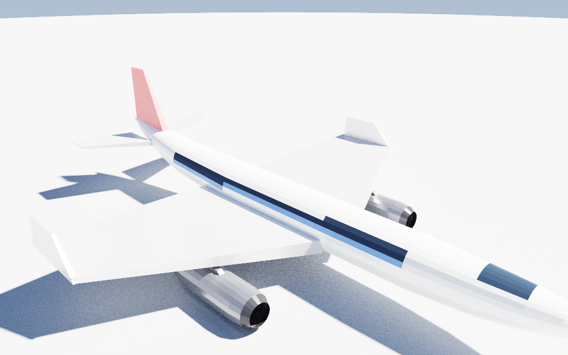
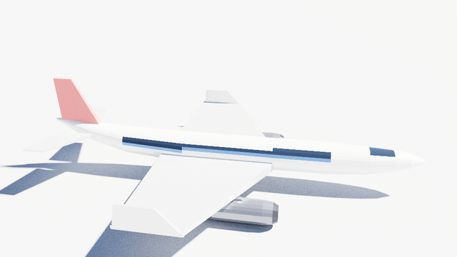
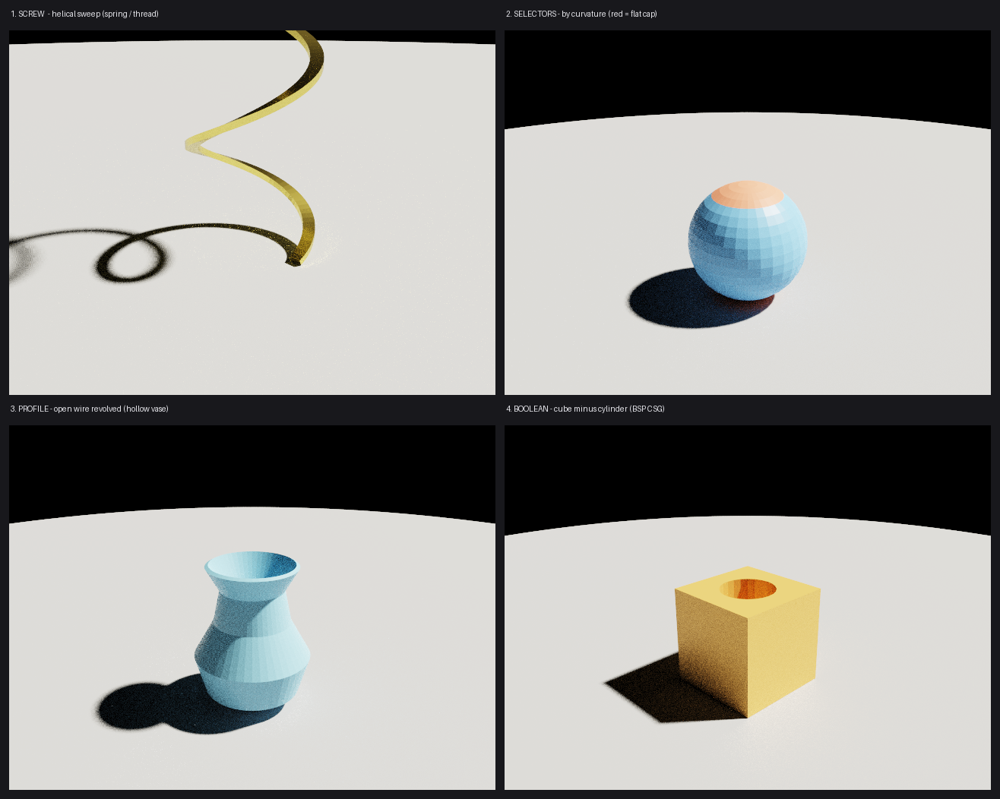

# Mirage

**An AI-native 3D renderer + lightweight physics simulator** — built to be driven by coding agents (e.g. Claude Code via [MCP](https://modelcontextprotocol.io)), aimed at robotics and synthetic-data use cases.

> **Status:** 🌱 early scaffold (`v0.0.1`), now pivoting. The data model and AI-native control surface are in place on dependency-free *null* backends; the v0.1 direction — **OpenUSD as the scene source of truth, with real engines (MuJoCo/Newton physics, Hydra/Cycles rendering) behind small interfaces** — is specced in [docs/design.md](docs/design.md).

## Gallery

Every image below is one op-log replayed through the native mesh kernel and shot
with the in-repo path tracer — no external DCC, no fakes.

**Beyond primitives** — a passenger jet modeled entirely from the engine's own
operators: a surface-of-revolution fuselage (the lathe), lofted swept wings with
winglets, capped-cylinder engines on pylons, all mirrored for symmetry and given
a per-face livery, then path-traced. Reproduce with `uv run python examples/airplane.py`.



That op-log isn't a static export. It **assembles part by part — fuselage, wings,
winglets, tail, engines — then turntables**, every frame path-traced by the in-repo
renderer. The op-log thesis made visible: a model is a *sequence of operations* you
can replay. Regenerate the clips (`.mp4` for video, `.gif` for inline) with
`uv run python docs/gallery/render_airplane_anim.py`.



The core operators, one panel each (regenerate with `uv run python docs/gallery/render_gallery.py`):



| | operator | what it is |
|---|---|---|
| **1** | `screw` | the helical sweep — a section revolved *while climbing the axis* → springs, threads, augers |
| **2** | `curvature` selector | selection-as-query by mean dihedral: the flat-ish cap resolves apart from the round body |
| **3** | `profile` | a first-class 2D generatrix — an **open** wire revolved makes a single-walled, hollow vase |
| **4** | `boolean` | real BSP mesh-mesh CSG (union / difference / intersection) — here a cube minus a cylinder bore |

Each modeling operator is implemented **byte-identically in the C++ core and the
Python kernel** and pinned by differential tests, so one op-log builds the same
mesh in either engine.

## Why

Powerful DCC tools (Blender, …) have large, stateful automation surfaces that are awkward for programmatic/agent control. Full robotics simulators are excellent but heavy. Mirage takes the opposite bet:

- **Scene = plain data.** The whole world is one serializable object (JSON today, USD later). An agent can read it, diff it, edit it, and reproduce it deterministically.
- **Tiny, swappable backends.** A backend just consumes a `Scene`: `render(scene, camera)` or `step(scene, dt)`. Start with zero-dependency null backends; plug in a real renderer (Cycles/Embree/OIDN — all permissively licensed) or physics (e.g. MuJoCo) behind the same interface.
- **AI-native control surface.** A first-class MCP server exposes the build/step/render loop as a handful of orthogonal tools, so Claude Code can drive Mirage out of the box.
- **Light, fast, permissive.** A Python-orchestrated core does the conducting; heavy lifting goes to native engines (OpenUSD, MuJoCo, Hydra/Cycles) behind small interfaces. Apache-2.0, no GPL entanglement.

## Quickstart

```bash
git clone https://github.com/saofund/mirage
cd mirage
pip install -e .
python examples/falling_box.py
```

## Use with Claude Code

This repo ships a **project-scoped** MCP config (`.mcp.json`), so Claude Code
picks Mirage up automatically when you open this folder as the workspace:

```bash
pip install -e ".[usd,mujoco,mcp,demos]"   # full surface: USD scene + MuJoCo physics/render + MCP
cd mirage                 # the project root, where .mcp.json lives
claude                    # approve the 'mirage' MCP server when prompted
```

Then `/mcp` shows `mirage` connected. The agent can **author** (`add_box`,
`add_sphere`, `add_cylinder`, `add_plane`, `add_camera`, `add_light`), **edit**
(`move`, `set_transform`, `set_material`, `set_velocity`, `remove`, `rename`),
**inspect & reproduce** (`get`, `list_objects`, `get_scene`, `set_scene`,
`diff_scene`, `save_scene`, `load_scene`, `get_log`, `replay_log`), and
**simulate & see** (`step`, `render`). Every tool returns structured JSON;
`render` returns a PNG the agent can look at.

Run the server standalone (for any other MCP client):

```bash
python -m mirage.mcp_server
```

## Architecture

See [docs/design.md](docs/design.md) for the v0.1 design & roadmap (and [docs/architecture.md](docs/architecture.md) for the current scaffold). In one diagram:

```
          agent (Claude Code)
                │  MCP tools
                ▼
          ┌───────────┐    reads / writes    ┌──────────┐
          │  Engine   │◀───────────────────▶ │  Scene   │   (JSON / USD)
          └───────────┘                       └──────────┘
            │       │
     step() │       │ render()
            ▼       ▼
     PhysicsBackend   RenderBackend
     (null → MuJoCo)  (null → Cycles/Embree)
```

## License

[Apache-2.0](LICENSE).
