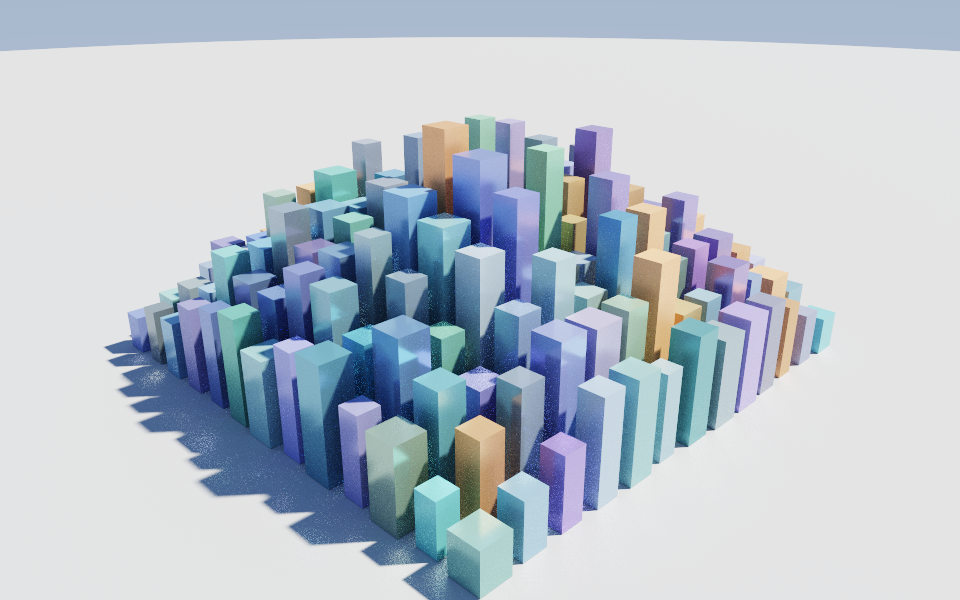

# Can Mirage build a whole scene? — scaling & bottlenecks

Short answer: **yes**, and here is one — a downtown of 169 buildings composed into a
single op-log mesh and path-traced by the same ground-truth renderer that shot the
airliner:



But *how* you build a scene at scale matters a lot, because Mirage today is **three
layers that don't fully connect**. This note maps them, stress-tests each, and says
where the walls are and what the real fixes are. Every number below is reproducible:

```bash
uv run python examples/cases/17_city_scene.py --bench   # the measurements here
uv run python examples/cases/17_city_scene.py --hero    # the image above
```

## The three layers

| Layer | Builds | Renders through | Reaches the path tracer? |
|---|---|---|---|
| **Mesh kernel** — `meshlang.MeshProgram` / `kernel.Mesh` | **one** mesh from a legible op-log | `mirage_render` (path traced) or `mirage_viewer` (raster) | ✅ (it *is* the tracer's input) |
| **Scene** — `session.Session` / `scene.Scene` (USD) | **many** objects (`add_box`, …) | **MuJoCo** rasterizer only | ❌ never |
| **Path tracer** — `core/src/raytrace.cpp` (`mirage_render`) | **one** merged triangle soup, with a BVH | — | — |

The consequence is the whole story: **the beautiful path tracer only speaks
"one mesh," and the multi-object Scene layer only renders through MuJoCo.** So a
path-traced "whole scene" has to be *merged into one mesh* first — which works
(the image above), but bypasses the Scene layer entirely.

## Stress test

### EXP 0 — the legible op-log is single-model

In `MeshProgram.build()` every primitive **replaces** the running mesh:

```
3x cube op -> 6 faces      (one cube = 6; they do not compose)
```

You cannot author a multi-object scene op-by-op the way an agent naturally would
(`cube`, `cube`, `cube`). The only op-log-native ways to get many objects are
`array` (**identical** instances only) or chained `boolean union` (the ~O(n²) BSP
op). To place *distinct* objects you fall back to a single raw `mesh` op with all
geometry inlined — the "import seam." That renders great, but it is a geometry
dump, not a legible operator sequence, and it carries no per-object identity.

### EXP 1 — the Scene layer scales, but render-per-edit is O(N²)

Authoring into the USD scene is cheap and roughly linear (~1 ms/object — USD prim
creation). The trap is **rendering**: every `add`/`move`/`set` calls
`Session._invalidate()`, and the next `render()`/`step()` **re-serializes the whole
scene to MJCF and recompiles the entire `MjModel` from scratch**. So a single
render is O(N) in the object count, and the natural "add one, look, add one, look"
agent loop is **O(N²)**:

```
N=400:  look ONCE 0.24s   vs   look every 20 adds  4.20s   ->  17x  for the SAME final scene
one render() at growing N:  100 -> 0.14s ... 2500 -> 1.55s ... 4900 -> 4.05s   (whole-model rebuild each time)
```

Nothing is cached, nothing is incremental, and identical geometry is not instanced
(every object is a distinct MuJoCo geom, and each mesh entity re-reads its OBJ from
disk on every recompile).

### EXP 2 — the merged-mesh → path-tracer path scales well

Composing everything into one `mesh` op and path-tracing it is the viable route to
a *beautiful* whole scene, and it holds up:

```
 bldgs   faces  build_ms  json_MB  trace_s (16spp)
   100     600         9     0.14      0.7
   400    2400        46     0.55      1.0
   900    5400        88     1.24      1.5
  2500   15000       278     3.48      2.1
  6400   38400       837     8.96      3.7
```

Render time is **sub-linear in triangle count** (the BVH earns its keep: 64× the
faces cost ~5× the trace time; the linear knobs are `spp`, resolution, and
`max_bounce`, not geometry). The costs that *do* grow are on the Python/interchange
side: `MeshProgram.build()` reconstructs the whole `Vert/Edge/Loop/Face` object
graph in interpreted Python (~0.84 s at 38k faces and rising), and the op-log JSON
inlines every vertex and face, so it bloats linearly (**~9 MB at 6,400 buildings**).

## Where the bottleneck really is

It isn't any single hot loop — it's an **architectural seam**. Mirage's thesis is
"one legible op-log is the single source of truth," and that is true and powerful
**for one model**. A *scene* of many models has no first-class home:

1. **The op-log can't compose objects** (primitives replace). There is no
   `instance`/`place`/`append` operator, so multi-object structure either lives in
   the separate USD Scene layer or gets flattened into a raw `mesh` dump.
2. **The renderer boundary is in the wrong place.** The ground-truth path tracer
   takes a single `mirage::Mesh` and is not exposed to Python at all; the Scene
   layer that actually holds many objects can only reach MuJoCo's rasterizer. The
   two never meet, so you cannot path-trace a `Session` scene.
3. **No instancing anywhere.** `array`, boolean merge, and the Scene layer all
   duplicate geometry rather than reference it, so object count turns directly into
   vertices, faces, JSON bytes, and MuJoCo geoms.
4. **The Scene sim is rebuilt whole on every edit** — the O(N²) trap above.

## Recommended fixes (real ones, in priority order)

1. **A scene → merged-mesh bridge** (small, high leverage). Lower a `Session`
   scene — or a list of op-logs with placements — into one `mesh` op and hand it to
   `mirage_render`. This is the missing connective tissue: it makes "path-trace my
   whole scene" a one-call reality instead of a manual merge, and it is what
   `examples/cases/17_city_scene.py` does by hand today.
2. **A first-class instancing / placement op** in the op-log and a TLAS/BLAS in the
   tracer, so a scene references sub-meshes instead of duplicating them. This kills
   both the JSON bloat and the memory blow-up, and it is the honest way to represent
   "100 of the same building."
3. **Incremental Scene compilation.** Cache the `MjModel` and add/remove bodies
   instead of recompiling from the MJCF string on every edit — turns the O(N²) agent
   loop back into O(N). Cheapest interim mitigation is guidance (below) plus a batch
   authoring API that defers `_invalidate` until a `flush()`.
4. **A faster kernel build path** for large meshes: incremental replay (don't
   re-run the whole log and re-`validate()` after every op), or a compiled
   fast-path, so `build()` isn't ~1 s at 40k faces.
5. **SAH BVH + a deeper/growable traversal stack** in the tracer for very large
   scenes (the current median-split build and fixed `stack[64]` are fine into the
   tens of thousands of faces but will bound the extreme end).

## Practical guidance today (and for agents)

- To build a large scene in the Scene layer: **author everything, then render once.**
  Never render inside the add loop — that is the 17× (and worsening) tax.
- To make a *path-traced* whole scene: **merge geometry into one `mesh` op** (as
  case 17 does) and drive `mirage_render`. Expect a multi-MB op-log; it traces in
  seconds thanks to the BVH.
- Reuse of identical geometry is not free anywhere yet — until instancing lands,
  every copy is real vertices.
