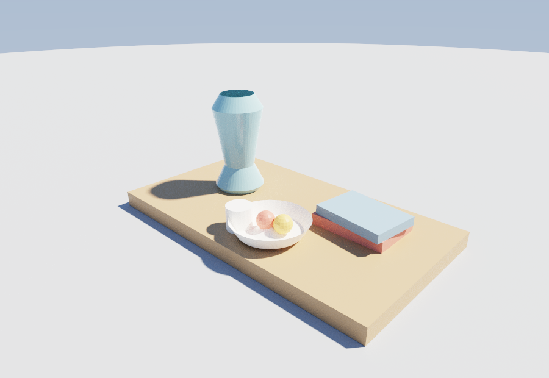

# The op-log is a file — drive Mirage by editing it directly

Mirage's model is a **legible op-log**, and an op-log is just a **JSON file**. So the
lightest way for a local agent (or you) to build or change a scene is to *edit the file
and render it* — no MCP server, no Python glue.

[`desk.json`](desk.json) is a whole little scene — a desk still life — as **8 `place`
ops**. Each `place` op drops one object (its own operators, in `program`) at a transform
(`translate` / `rotate` / `scale`) with a `material`. That file *is* the scene, and the
path tracer reads it straight:



```jsonc
// desk.json — one of the 8 place ops (the vase, turned on the lathe)
{ "op": "place",
  "translate": [-0.42, 0.06, 0.0], "rotate": [0,0,0], "scale": [1,1,1],
  "program": [                                   // the object's own operators
    { "op": "profile", "points": [[0.13,0],[0.15,0.03],[0.09,0.15],[0.12,0.34],[0.15,0.5],[0.1,0.58]], "plane": "xz" },
    { "op": "spin", "axis": "z", "steps": 48 }   // revolve the profile -> a vase
  ],
  "material": { "color": [0.28,0.47,0.52], "metallic": 0.0, "roughness": 0.14 } }
```

## The loop: edit → render → look

```bash
# render desk.json straight to an image; the --cam-* flags place the camera
core/build/Release/mirage_render.exe --oplog examples/oplogs/desk.json \
  --out desk.ppm --spp 200 --w 900 --h 620 \
  --cam-eye 1.45 -1.6 1.12 --cam-target -0.02 -0.05 0.14 --cam-fov 0.82 \
  --threads 12        # cap CPU workers; omit to use every core
```

`mirage_render` writes a PPM (open it directly, or convert:
`python -c "from PIL import Image; Image.open('desk.ppm').save('desk.png')"`).

Now **edit the file and re-render** — every change is real and reproducible:

- **Recolor** — change a `"material": { "color": [...] }`. Make the vase (the 2nd `place`
  op) amber: `[0.85, 0.55, 0.15]`.
- **Move / rotate** — bump a `"translate"` or `"rotate"` (degrees, XYZ).
- **Reshape** — the vase is a `profile` (a 2D silhouette) fed to `spin` (the lathe). Nudge
  a profile point and watch the vessel change; drop `spin`'s `angle` below 360 to leave it
  half-turned.
- **Add an object** — copy a `place` block, give it a new `program` (any operators — a
  `cube`, a `cylinder`, another `profile`+`spin`) and a `translate`.

The same file loads in the native `mirage_viewer` GUI and over MCP (`place_object`), so
this is one source of truth with three ways in. Prefer this file path when you're a local
agent in the repo; prefer MCP from a decoupled client. See
[`../../skills/mirage/SKILL.md`](../../skills/mirage/SKILL.md).
